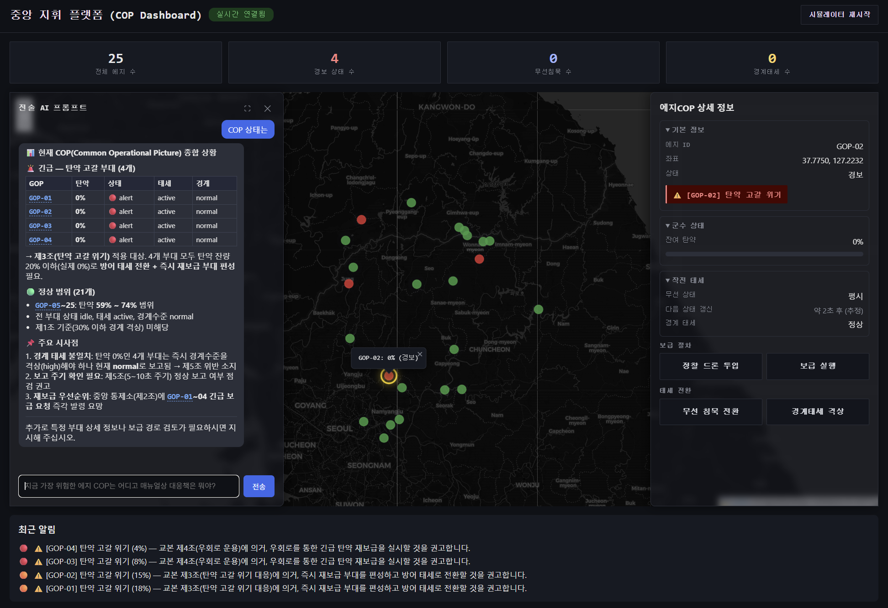

# D4D 해커톤 — 에지 COP ↔ 중앙 지휘 플랫폼 (Edge COP / Central Intelligence Platform)

> **폐쇄망(에어갭)에서도 끊기지 않는 지휘통제 순환 — Data & AI Sovereignty for the Battlefield**
>
> D4D | Deploy for Defense Hackathon APAC – Seoul · Track **T3. Battle Network, C2 & Sustainment** 출품작

10시간 내에 만든 MVP로, 전방에 흩어진 수십 개의 "에지 COP(전초기지)"가 실시간으로 상태를 쏘고, 중앙 지휘 플랫폼이 이를 지도에 시각화 · 위기를 자동 감지 · AI로 대응책을 제시 · 명령을 다시 에지에 하달하는 **전체 지휘통제 순환**을 눈으로 보여줍니다.



---

## 1. 문제 정의

- 야전/폐쇄망 환경의 전초기지(GOP 분초, 자주포 진지 등)는 통신이 제한적이고, 탄약·보급 상태가 실시간으로 상급 지휘부에 집계되지 않는 경우가 많습니다.
- 위기 상황(탄약 고갈 등)을 지휘관이 인지하고 교범에 맞는 대응책을 판단해 명령을 하달하기까지 사람이 개입하는 지연이 큽니다.
- 실제 배치 환경은 외부 인터넷 연결을 신뢰할 수 없는 **폐쇄망(에어갭)**이 전제인 경우가 많습니다.

## 2. 우리가 만든 것

에지(전초기지) 수십 개를 모킹하고, 중앙 서버가 상태를 수집·감시·시각화하고, AI가 상황을 요약·권고하고, 지휘관이 대시보드에서 버튼 하나로 명령을 하달하는 **자기완결형 순환 구조**를 구현했습니다. 전체가 로컬 네트워크(WebSocket)만으로 동작하도록 설계되어, "인터넷 연결 없이도 동작하는 지휘통제 플랫폼"이라는 폐쇄망 주권 테마를 데모로 증명합니다.

이 MVP는 즉흥적인 해커톤 아이디어가 아니라, [파스업(PAASUP)](https://www.paasup.io)의 중앙 인프라인 **파스업 DIP(Data Intelligence Platform)**와, 파스업이 이미 추진 중인 R&D 로드맵을 축소 재현한 프로토타입입니다.

- **파스업 DIP**: 폐쇄망(에어갭) 환경에서도 SaaS 수준의 데이터 인텔리전스·AI 소버린티를 제공하는 파스업의 핵심 플랫폼. 이번 데모의 중앙 COP는 DIP의 데이터·AI 파이프라인 구조를 축소 재현한 형태입니다.
- **R&D 로드맵 (2건)**: 2026-04 디딤돌 R&D 과제 "Edge DIP"(폐쇄망 전용 에지 데이터 인텔리전스 플랫폼), 2026-06 업스테이지 협업 "국방 특화 LLM Agent".

## 3. 아키텍처

```
┌─────────────────────┐        WS /ws/edge (state push)        ┌──────────────────────────┐
│  edge-simulator      │ ───────────────────────────────────▶ │                          │
│  (가상 에지 25개,     │                                        │   central-backend        │
│   5~10초 주기 송신)    │ ◀─────────────────────────────────── │   (FastAPI + WebSocket,  │
└─────────────────────┘        WS /ws/command (명령 하달)        │   in-memory store,       │
                                                                │   rule engine,           │
                                                                │   chat engine)           │
                                                                └──────────────┬───────────┘
                                                                               │
                                                        WS /ws/dashboard (실시간 push)
                                                        REST /api/state, /api/alerts,
                                                        /api/command, /api/chat
                                                                               │
                                                                               ▼
                                                                ┌──────────────────────────┐
                                                                │  dashboard-web           │
                                                                │  (Vanilla JS + Leaflet)  │
                                                                │  지도·경보·챗봇·명령 UI   │
                                                                └──────────────────────────┘
```

- 데이터 모델은 [shared/schemas.py](shared/schemas.py)의 pydantic 모델(`EdgeState`, `Command`, `AlertEvent`) 하나만 3개 컴포넌트가 공유합니다.
- 저장소는 인메모리([central-backend/store.py](central-backend/store.py))로, 해커톤 시연 목적에 맞게 DB 세팅 시간을 없앴습니다.

### 3-1. 확장 아키텍처 (실전 배치 시 — 파스업 DIP / Edge DIP / RAG)

위 MVP 구조의 `central-backend`(in-memory)와 `edge-simulator`는 실전 배치 시 [파스업](https://www.paasup.io)의 **DIP / Edge DIP** 데이터·AI 파이프라인으로 그대로 대체됩니다. 즉 이번 데모는 아래 실증 아키텍처를 "인메모리 + 룰 엔진"으로 축소 재현한 것입니다.

```
┌───────────────────────┐   MQTT (센서/장비 상태)   ┌────────────────────────────────┐
│  에지 COP (전초기지,    │ ───────────────────────▶ │   파스업 Edge DIP                │
│  다중, 폐쇄망 로컬)      │ ◀─────────────────────── │   · 데이터 카탈로그:              │
└───────────────────────┘        명령 하달           │     MQTT → StarRocks → Iceberg  │
                                                     │   · RAG: 경량 vLLM → Qdrant     │
                                                     │     (에지 로컬 실시간 추론,       │
                                                     │      회선 단절 시에도 자체 판단)   │
                                                     └───────────────┬─────────────────┘
                                                                     │ 에지 다중 연계 (Kafka)
                                                                     ▼
                                                     ┌────────────────────────────────┐
                                                     │   파스업 DIP (중앙)              │
                                                     │   · 데이터 카탈로그:              │
                                                     │     Kafka → StarRocks → Iceberg │
                                                     │   · RAG: vLLM → Milvus          │
                                                     │     (전술 AI 챗봇, 대규모 컨텍스트)│
                                                     └───────────────┬─────────────────┘
                                                                     │
                                                                     ▼
                                                     ┌────────────────────────────────┐
                                                     │   지휘관 대시보드 / 명령 하달      │
                                                     └────────────────────────────────┘
```

- **에지 COP → 파스업 Edge DIP**: 저전력·저대역 MQTT로 수집, StarRocks/Iceberg에 적재, 경량 vLLM + Qdrant로 에지 단에서도 회선 단절 시 자체 추론이 가능한 RAG 환경 구성.
- **중앙 COP → 파스업 DIP**: 다수 에지 DIP의 데이터를 Kafka로 집계해 StarRocks/Iceberg에 적재, vLLM + Milvus 기반 대규모 RAG로 지휘관 챗봇·상황 요약 고도화.
- 두 RAG 스택 모두 폐쇄망 내부에서 완결되므로, 외부 인터넷·클라우드 LLM 없이도 "데이터·AI 소버린티"가 유지됩니다.

### 3-2. AI 설계 철학 — 데이터 통합 → 정책 매핑 → 액션 모델

이 프로젝트의 AI/데이터 설계는 팔란티어(Palantir)의 **데이터 통합(Data Integration) → 정책/매뉴얼(작계) 매핑 → 액션 모델(Action Model)** 패턴을 참조했습니다.

1. **데이터 통합**: 흩어진 에지 COP들의 실시간 상태(`EdgeState`)가 중앙에 통합되어 하나의 상황판(COP)을 구성합니다.
2. **정책 매핑**: 통합된 데이터를 룰 엔진이 작계 매뉴얼(교범) 조항과 매칭해 대응 정책을 도출합니다. 챗봇도 임의 생성이 아니라 이 교범 정책과 실시간 에지 데이터에 근거해서만 응답하도록 설계했습니다.
3. **액션 모델 (향후 과제)**: 현재는 정책 매핑 결과(권고문)를 지휘관이 보고 버튼으로 직접 명령을 하달하는 단계까지 구현했습니다. 다음 단계로는 (사전에 허용된 범위 내에서) AI 에이전트가 정책 매핑 결과에 따라 액션 프로세스를 스스로 실행·추적하는 것을 목표로 합니다.

## 4. 핵심 기능

| 영역 | 내용 |
|---|---|
| **실시간 상황판** | 에지 25개가 지도 위에 개별 마커로 표시, WebSocket push로 진짜 실시간 갱신 (폴링 없음) |
| **룰 기반 자동 경보** | 탄약 ≤20% → warning, ≤10% → critical 알림 자동 발생, 교범(`docs/국방_군수지원_교본.txt`) 조항 자동 매칭·권고 |
| **하이브리드 AI 챗봇** | 사전정의 룰 기반 응답을 기본으로, OpenCode Go(MiniMax M3) LLM 키가 있으면 교범+실시간 에지 상태를 컨텍스트로 넣어 자연어 질의응답, 실패 시 룰 기반으로 자동 폴백 |
| **7종 원격 명령 하달** | `RESUPPLY`(보급) · `RECON_DRONE`(정찰 드론) · `DETOUR_RECON`(우회로 정찰) · `SILENT_MODE`/`ACTIVE_MODE`(무선 침묵 전환) · `ALERT_LEVEL_UP`/`DOWN`(경계태세) |
| **원클릭 시나리오 리셋** | "시뮬레이터 재시작" 버튼 한 번으로 전 에지 초기화 + 일부 에지는 즉시 탄약 경보 재현 (반복 시연용) |

## 5. 빠른 실행 방법 (Quick Start)

3개 터미널이 필요합니다. (Python 3.11+ 권장)

```bash
# 1) 중앙 백엔드 + 대시보드 정적 서빙
cd central-backend
pip install -r requirements.txt
uvicorn main:app --reload --port 8000

# 2) 에지 시뮬레이터 (가상 에지 25개 구동)
cd edge-simulator
pip install -r requirements.txt
python main.py

# 3) 브라우저에서 대시보드 접속
# http://localhost:8000
```

- 챗봇에 LLM을 붙이려면 `.local.env`에 `API_KEY=...`(OpenCode Go 구독 키)를 넣으세요. 키가 없으면 자동으로 룰 기반 응답으로 동작합니다.
- 데모 리허설을 자동으로 돌려보려면: `python scripts/demo_scenario.py` (백엔드가 떠 있어야 함)

## 6. 3분 데모 시나리오

[scripts/demo_scenario.py](scripts/demo_scenario.py)에 자동화되어 있는 시연 흐름입니다.

1. **오프닝** — 지도 위 25개 에지가 5~10초 주기로 실시간 상태를 쏘는 화면 확인. "이 구조 전체가 인터넷 없이 로컬 네트워크만으로 동작합니다."
2. **위기 발생** — 특정 에지 탄약을 강제로 15%까지 낮춰(`POST /api/debug/set_ammo`) 경보 알림 + 교범 기반 권고문이 즉시 뜨는 것을 확인.
3. **지휘관 의사결정 지원** — 챗봇 창에 "가장 위험한 에지는?" 질의 → AI가 즉시 상황 요약 + 교범 기반 답변.
4. **다중 명령 하달** — `RECON_DRONE`(정찰) → 결과 확인 후 `RESUPPLY`(보급) → `SILENT_MODE`/`ACTIVE_MODE`(무선 침묵 전환) → `ALERT_LEVEL_UP`/`DOWN`(경계태세) 순서로 하달하며 지도·사이드바 상태가 실시간으로 바뀌는 것을 시연.
5. **마무리 & 로드맵** — "지금 보신 것은 파스업이 디딤돌 R&D 과제로 개발 중인 Edge DIP와 업스테이지 협업 국방 특화 LLM Agent의 축소 프로토타입입니다"로 마무리, 실증 인프라 확장 로드맵(§8) 제시.

## 7. 엔드포인트 계약

| 엔드포인트 | 방향 | 스키마 | 소유 |
|---|---|---|---|
| `WS /ws/edge` | 에지 → 중앙 (push) | `EdgeState` | central-backend |
| `WS /ws/command` | 중앙 → 에지 (push) | `Command` | central-backend |
| `GET /api/state` | 대시보드 ← 중앙 | `list[EdgeState]` | central-backend |
| `GET /api/alerts` | 대시보드 ← 중앙 | `list[AlertEvent]` | central-backend |
| `POST /api/command` | 대시보드 → 중앙 (하달 버튼) | `Command` | central-backend |
| `POST /api/chat` | 챗봇 UI → AI 엔진 | `{query: str}` → `{answer: str}` | central-backend |
| `POST /api/simulator/restart` | 대시보드 → 중앙 (재시작 버튼) | 없음 → `{ok: bool}` | central-backend |
| `WS /ws/dashboard` | 중앙 → 대시보드 (push, 다중 클라이언트) | `{"kind": "state"\|"alert", "data": ...}` | central-backend |

전체 규칙은 [CLAUDE.md](CLAUDE.md)를 참고하세요.

## 8. 향후 로드맵 (실전 배치 확장 계획)

이번 데모는 10시간 제약으로 인메모리 + 룰 기반 코어를 채택했지만, 실전 배치 시 중앙/에지 COP가 파스업 DIP / Edge DIP로 확장되는 구조는 [§3-1 확장 아키텍처](#3-1-확장-아키텍처-실전-배치-시--파스업-dip--edge-dip--rag)에 정리되어 있습니다. 그 외 추가 확장 방향은 다음과 같습니다.

- **에지 영상 전송**: 에지 실시간 영상을 중앙 COP로 전달, 네트워크 상황에 따라 해상도·메시지 전달 체계 자동 조정
- **OSINT 분석 연계**: 중앙 COP가 에지 지역 OSINT 정보를 분석해 권고 메시지로 제시, 승인된 정보만 에지로 재전달
- **이동 경로 시계열 예측**: 에지의 위치 이동 경로를 시뮬레이션하고 향후 이동 경로까지 예측
- **작전 목표 중심 액션 플랜**: 개별 상태 대응을 넘어, 작전 목표 달성을 위한 방법론 제안 및 실행 추적

> 데모의 챗봇은 개발 시간 제약상 외부 API(OpenCode Go)로 시뮬레이션한 것이며, 실제 상용 버전은 폐쇄망 내 사설 LLM(vLLM 기반)으로 대체됩니다.

## 9. 기술 스택

- **central-backend**: Python, FastAPI, WebSocket, Pydantic, OpenAI SDK(호환 게이트웨이 경유)
- **edge-simulator**: Python, asyncio, websockets
- **dashboard-web**: Vanilla JS, Leaflet.js (지도 시각화), 순수 WebSocket 구독
- **저장소**: in-memory dict/list (해커톤 스코프)

## 10. 프로젝트 구조

```
shared/             # 3개 컴포넌트가 공유하는 pydantic 데이터 모델 (schemas.py)
central-backend/    # FastAPI 서버: 상태 수집, 룰 엔진, 챗봇 엔진, 대시보드 정적 서빙
edge-simulator/     # 가상 에지 25개 시뮬레이터
dashboard-web/      # 대시보드 프론트엔드 (지도, 사이드바, 챗봇 UI)
scripts/            # 데모 리허설 자동화 스크립트
docs/               # 기획 배경 문서, 더미 교범 텍스트
```
